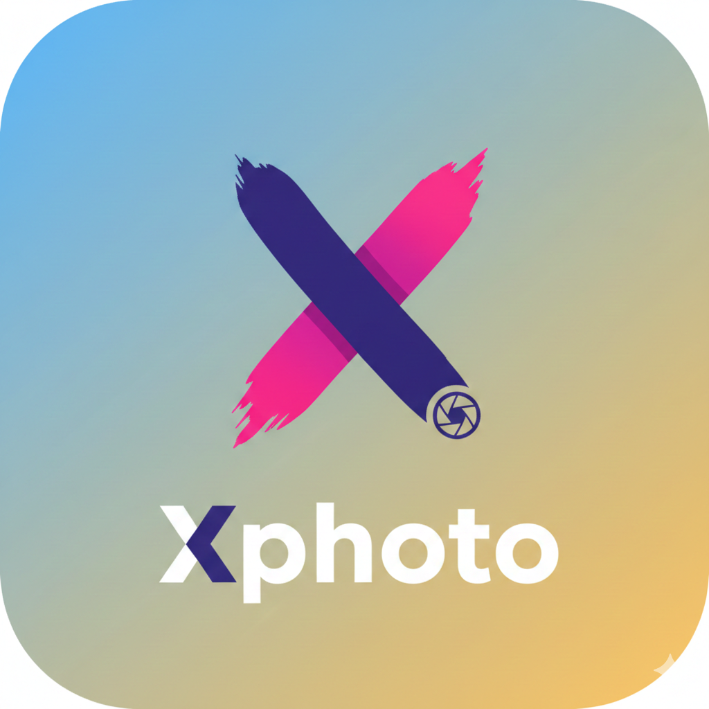
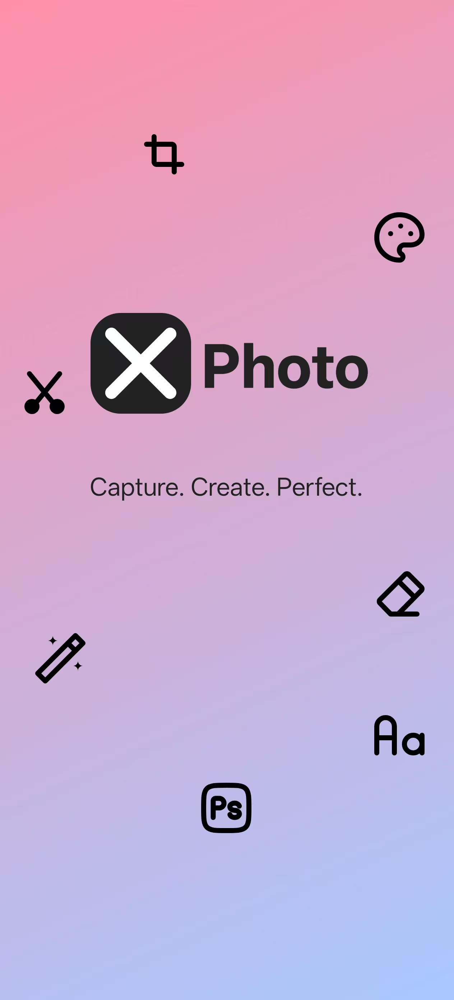
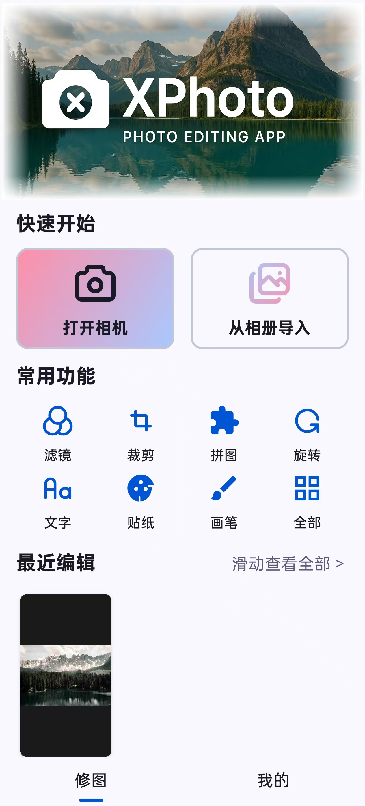
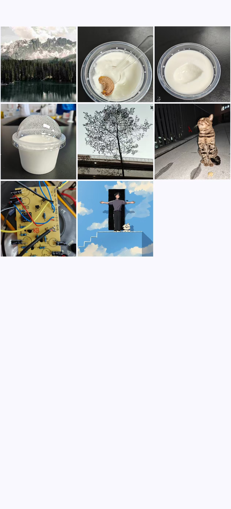
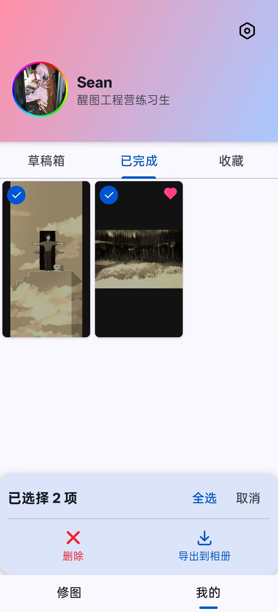
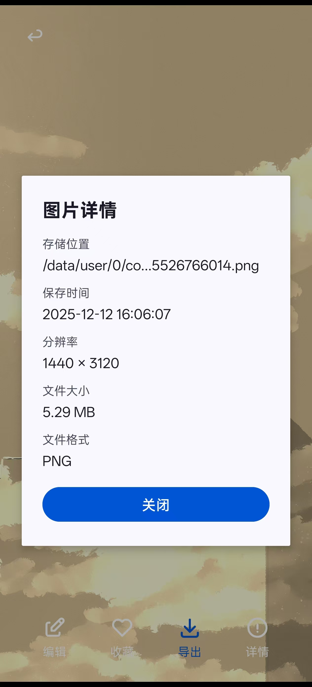
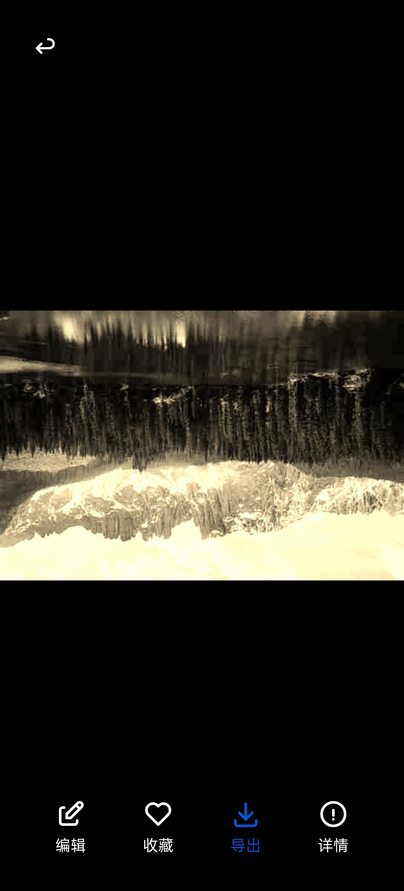
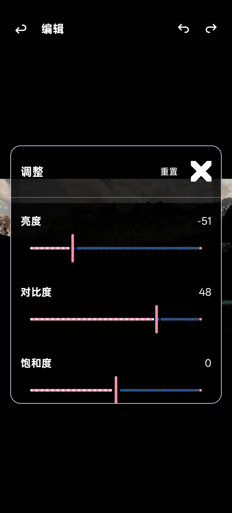
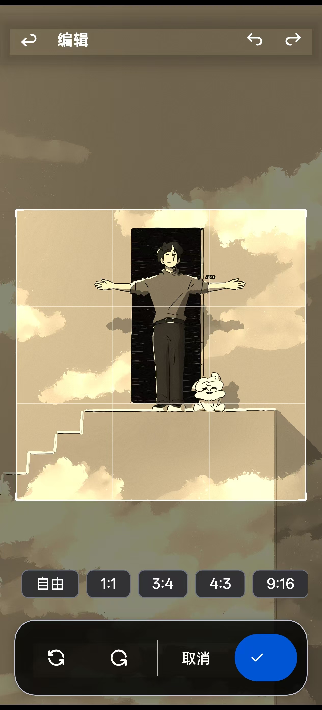

# 醒图风格图片编辑器

<p align="center">
  
</p>

<p align="center">
  <strong>一款基于 Android 原生开发的专业图片编辑应用</strong>
</p>

<p align="center">
  
  
  
  
  
</p>

---

## 项目简介

本项目是一款参考「醒图」设计理念的图片编辑应用，采用 **Kotlin** 语言开发，运用 **Jetpack** 组件和 **OpenGL ES 2.0** 实现高性能图片渲染与编辑功能。

### 核心特性

- **品牌启动页** - 渐变背景 + 功能图标装饰，1 秒品牌展示
- **专业滤镜** - 10 种预设滤镜，基于 GPU 着色器实时渲染
- **智能裁剪** - 支持自由裁剪和 6 种固定比例（1:1、3:4、4:3、9:16、16:9）
- **参数调整** - 9 种专业调整参数（亮度、对比度、饱和度、高光、阴影、色温、色调、清晰度、锐化）
- **无限撤销** - 完整的 Undo/Redo 历史记录，支持裁剪等破坏性操作的回退
- **手势操作** - 双指缩放、单指拖拽、惯性滑动，流畅的交互体验
- **多格式支持** - 支持 JPEG、PNG、WebP、GIF 等多种图片格式
- **视频预览** - 支持视频缩略图展示和播放

---

## 功能截图

### 启动页

| 启动页 |
|:---:|
|  |

启动页采用蓝粉渐变背景，中央展示标识 "XPhoto"，周围散布裁剪、滤镜、美颜等功能图标，底部显示标语 "Capture. Create. Perfect."。延迟 1 秒后自动跳转到主界面。

### 首页

| 首页主界面 |
|:---:|
|  |

### 相册

| 相册网格 | 多选模式 | 媒体详情 |
|:---:|:---:|:---:|
|  |  |  |

### 编辑器

| 编辑主界面 | 滤镜效果 | 参数调整 |
|:---:|:---:|:---:|
|  |  |  |

| 裁剪功能 | 旋转功能 | 导出结果 |
|:---:|:---:|:---:|
|  |  |  |

### 自定义 View 效果

| 扫光效果 | 彩虹边框 |
|:---:|:---:|
|  |  |

---

## 技术架构

```
+-------------------------------------------------------------+
|                         UI Layer                            |
|  +-------------+  +-------------+  +---------------------+  |
|  |  Activity   |  |  Fragment   |  |   Custom View       |  |
|  |  (Editor)   |  |  (Home/My)  |  |   (CropOverlay)     |  |
|  +------+------+  +------+------+  +----------+----------+  |
+---------+----------------+-------------------+---------------+
          |                |                   |
          v                v                   v
+-------------------------------------------------------------+
|                      Repository Layer                        |
|  +-----------------+  +-----------------+  +-------------+  |
|  | DraftRepository |  |EditedImageRepo  |  | AlbumRepo   |  |
|  +--------+--------+  +--------+--------+  +------+------+  |
+-----------+--------------------+-----------------+-----------+
            |                    |                 |
            v                    v                 v
+-------------------------------------------------------------+
|                       Data Layer                             |
|  +----------------------------------------------------------+|
|  |                    Room Database                         ||
|  |  +----------+  +----------+  +----------+  +---------+  ||
|  |  | DraftDao |  |EditedDao |  | AlbumDao |  | UserDao |  ||
|  |  +----------+  +----------+  +----------+  +---------+  ||
|  +----------------------------------------------------------+|
+-------------------------------------------------------------+
```

### 技术栈

| 类别 | 技术 |
|------|------|
| **语言** | Kotlin 1.9+ |
| **最低 SDK** | Android 7.0 (API 24) |
| **目标 SDK** | Android 15 (API 35) |
| **UI 框架** | Android View System |
| **图形渲染** | OpenGL ES 2.0 |
| **数据库** | Room |
| **异步处理** | Kotlin Coroutines + Flow |
| **图片加载** | Glide |
| **视频播放** | Media3 ExoPlayer |
| **依赖注入** | 手动依赖注入 |

---

## 构建与运行

### 环境要求

| 工具 | 版本要求 |
|------|----------|
| **Android Studio** | Ladybug (2024.2.1) 或更高版本 |
| **JDK** | 17 或 21（**不支持 Java 25**） |
| **Gradle** | 8.9+ |
| **Android SDK** | API 24 - 35 |

### 克隆项目

```bash
git clone https://github.com/your-username/MyApplication.git
cd MyApplication
```

### 配置 Java 版本

> **重要**：本项目不支持 Java 25（早期访问版本），请使用 Java 17 或 21 LTS 版本。

**方式一：设置环境变量**

```bash
# Windows
set JAVA_HOME=C:\Program Files\Java\jdk-17

# macOS/Linux

export JAVA_HOME=/usr/lib/jvm/java-17-openjdk
```

**方式二：在 gradle.properties 中指定**

```properties
org.gradle.java.home=C:/Program Files/Java/jdk-17
```

**方式三：在 Android Studio 中设置**

1. 打开 `File` -> `Settings` -> `Build, Execution, Deployment` -> `Build Tools` -> `Gradle`
2. 在 `Gradle JDK` 下拉框中选择 JDK 17 或 21

### 构建项目

**使用 Android Studio**

1. 打开 Android Studio
2. 选择 `File` -> `Open`，选择项目根目录
3. 等待 Gradle 同步完成
4. 点击 `Run` 按钮或按 `Shift + F10`

**使用命令行**

```bash
# 构建 Debug 版本
./gradlew assembleDebug

# 构建 Release 版本
./gradlew assembleRelease

# 安装到设备
./gradlew installDebug
```

### 运行测试

```bash
# 运行单元测试
./gradlew test

# 运行 Instrumented 测试
./gradlew connectedAndroidTest
```

---

## 项目结构

```
app/src/main/
├── java/com/example/myapplication/
│   ├── MyApplication.kt              # Application 类
│   ├── MainActivity.kt               # 主 Activity
│   ├── data/
│   │   ├── database/
│   │   │   └── AppDataBase.kt        # Room 数据库
│   │   ├── dao/                      # 数据访问对象
│   │   ├── entity/                   # 实体类
│   │   └── repository/               # 数据仓库
│   ├── ui/
│   │   ├── home/                     # 首页模块
│   │   ├── my/                       # 我的页面模块
│   │   ├── widget/                   # 自定义 View
│   │   │   ├── ShimmerImageView.kt   # 扫光效果
│   │   │   ├── RainbowBorderImageView.kt # 彩虹边框
│   │   │   └── CropOverlayView.kt    # 裁剪覆盖层
│   │   ├── AlbumActivity.kt          # 相册页面
│   │   ├── EditorActivity.kt         # 编辑器页面
│   │   ├── ImageRenderer.kt          # OpenGL 渲染器
│   │   └── FilterType.kt             # 滤镜类型
│   └── utils/
│       ├── MediaStoreHelper.kt       # 媒体库工具
│       └── PermissionHelper.kt       # 权限工具
├── res/
│   ├── layout/                       # 布局文件
│   ├── drawable/                     # 图形资源
│   ├── values/                       # 值资源
│   └── navigation/                   # 导航图
└── AndroidManifest.xml               # 清单文件
```

---

## 配置说明

### 权限配置

应用需要以下权限：

```xml
<!-- 相机权限 -->
<uses-permission android:name="android.permission.CAMERA" />

<!-- 媒体权限 (Android 13+) -->
<uses-permission android:name="android.permission.READ_MEDIA_IMAGES" />
<uses-permission android:name="android.permission.READ_MEDIA_VIDEO" />

<!-- 存储权限 (Android 12 及以下) -->
<uses-permission android:name="android.permission.READ_EXTERNAL_STORAGE" 
    android:maxSdkVersion="32" />
<uses-permission android:name="android.permission.WRITE_EXTERNAL_STORAGE" 
    android:maxSdkVersion="28" />
```

### ProGuard 配置

Release 版本已启用代码混淆，配置文件位于 [app/proguard-rules.pro](app/proguard-rules.pro)。

---

## 相关文档

- [基础项目报告](docs/PROJECT_REPORT_BASIC.md) - 包含 6 个基础要点的详细实现说明
- [进阶项目报告](docs/PROJECT_REPORT_ADVANCED.md) - 包含 P0 工程化插件和 P2 图像编辑功能

---

## 测试设备

应用已在以下设备上测试通过：

| 品牌 | 型号 | 系统版本 | 状态 |
|------|------|----------|------|
| 一加 | ACE 5 | ColorOS 16.0 | 通过 |
| OPPO | A1 Pro | ColorOS 14.0 | 通过 |
| 华为 | Mate 30 | HarmonyOS 4.2.0 | 通过 |

---

## 贡献指南

1. Fork 本仓库
2. 创建特性分支 (`git checkout -b feature/AmazingFeature`)
3. 提交更改 (`git commit -m 'Add some AmazingFeature'`)
4. 推送到分支 (`git push origin feature/AmazingFeature`)
5. 提交 Pull Request

---

## 开源协议

本项目采用 MIT 协议开源，详见 [LICENSE](LICENSE) 文件。

---

## 致谢

- [Glide](https://github.com/bumptech/glide) - 图片加载库
- [Media3](https://developer.android.com/media/media3) - 视频播放库
- [Room](https://developer.android.com/training/data-storage/room) - 数据库库

---

<p align="center">
  Made with love
</p>
